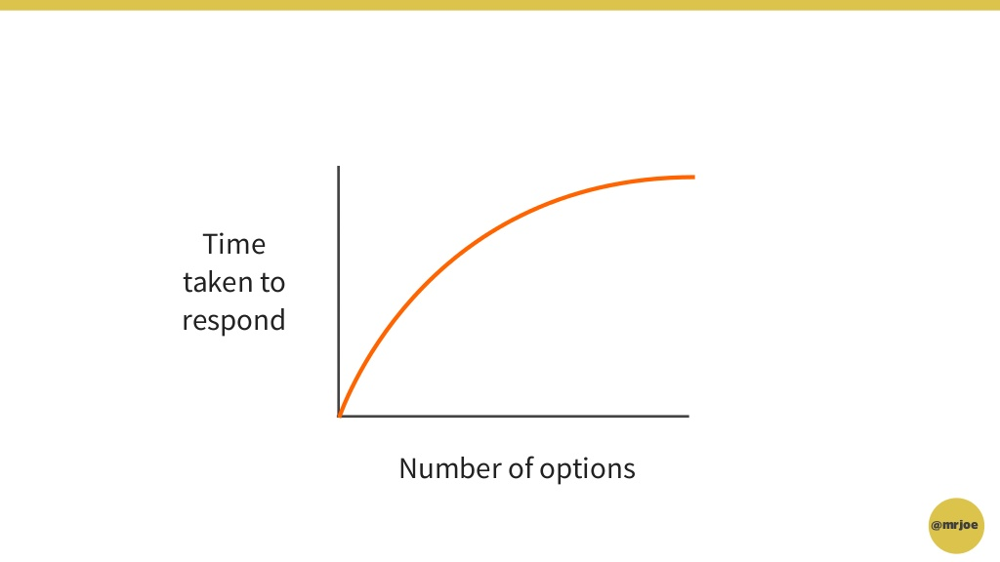
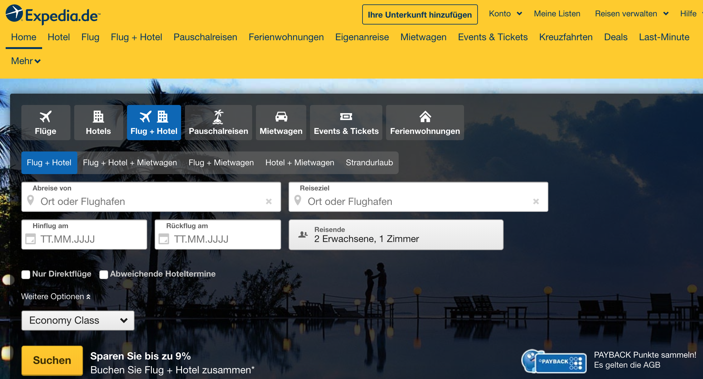

# SmashingConf Freiburg
## 9. & 10. 09. 2019

### Jonas Fährmann & Marco Ernst

---

# Agenda

1. Designing Powerfull User Experiences /w Psycology
1. The Anatomy of a Click
1. Every Product has a Voice
1. International is the new Mobile First
1. Life is a Mystery

---

# Designing Powerfull User Experiences /w Psycology
## Joe Leesh

---

## Im Oktober 2011 gab es einen Einbruch in der Verkehrsunfallstatistik von Abu Dhabi von  **40%**

# Warum?

---

# Blackbarry hatte den schlimmsten Systemausfall ihrer Firmengeschichte!

---

## Was macht der durchschnittliche Deutsche, während er **GNTM** guckt?

---

# Er surft im Internet!

---

# Was lernen **wir** daraus?

## Nutzer schenken uns selten ihre volle Aufmerksamkeit

---

---

# Hick's Law

---

---

## Das Ergebnis:
# Hohe kognitive Last

---

## Wie können wir diese Last reduzieren?
#  Das "Mental Model" des Nutzers verstehen und bedienen.

1. **Gewohntes Verhalten**
1. **Gewünschtes Verhalten**

---
## Gewohntes Verhalten

# Nutzer haben bestimmte Muster gelernt
# Versucht nicht das Rad neu zu erfinden
# Kopiert von anderen wo es gut läuft

---

## Beispiel Wikipedia

- Wikipedia hatte die Suche links in der Navigation

- Um sich an das Mental Model der Nutzer anzupassen, wurde sie nach oben rechts verschoben

- Massenbeschwerden der Nutzer

- Monate später: **Bessere Nutzerzahlen als je zuvor**

---

---

## Gewünschtes Verhalten

# "Ich möchte an den Strand. Maximal 3 Stunden Fahrt, 5 Tage, in den Sommerferien in NRW"

---

---

# The Anatomy of a Click
## Uri Shaked & Benjamin Gruenbaum

---

---

# Every Product has a Voice
## Benjamin Hersch

---

---

# International is the new Mobile First
## Robyn Larson

---

- Neuer, globalisierter Markt 
    -
- Design muss in jedem Land gut aussehen 
    -
- Content muss in jedem Land kulturell angemessen sein
    -

---

# Zeichenanzahl stellt neue Herausforderung dar
## Basis: **Englisch**
## Deutsch: **150%**
## Japanisch: **50%**

---

# Bilder & Layouts müssen angepasst sein

## Beispiele:
- Koreaner in Japanischem Webshop
- Text in Bildern
- Reihenfolge von Form-Elementen

---

# Life is a Mystery (Love, Hellfire & ...?)
## Seb Lester

---

# Lettering Artist
## Er malt Schriftzüge und Logos
## Er erfindet Schriftarten

---

## Intel
## Olympische Winterspiele
## Ariel Verpackung
## Londoner öffentliche Verkehrsmittel
## G8 Gipfel 2008

---

# Logo für die NASA SWOT Mission
# Illustationen für die iPad Werbung (Apple Pencil)

---
